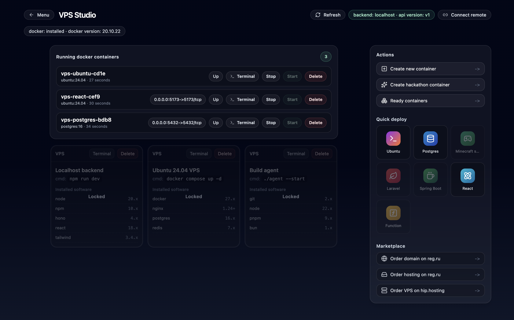

# VPS Studio

## Website

**[https://vps-studio.com](https://vps-studio.com)**

Manage dev containers and environments in a couple of clicks. Run development apps locally or on a remote server—with minimal manual console work. A Docker Desktop alternative for development with fast project bootstrapping (in the spirit of dev.new).

## Features

- **Local & Remote Backends**: Connect to localhost or remote servers via URL
- **SSH Automation**: Automate server setup via SSH (Ubuntu 24.04)
- **Container Management**: Install databases, deploy applications and images from marketplace
- **Serverless Functions**: Deploy serverless functions (coming soon)
- **Observable UI**: Real-time status, logs, and progress tracking
- **Community Edition**: Free forever, no paywalls

## Screenshots

## License

MIT
